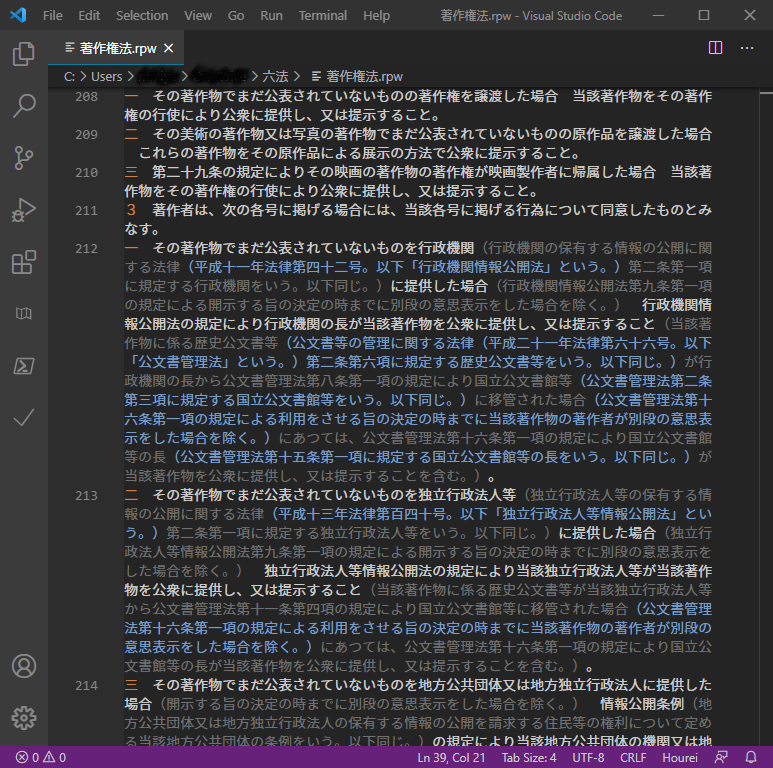
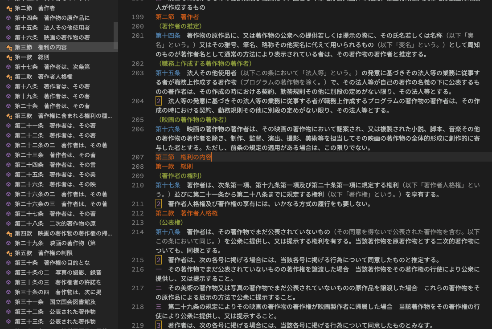

# HoureiHighlight README

法令テキストのハイライト表示

## 機能
法令のテキストデータの条・項・号番号、編・章・節・款等の番号、括弧書きその他の部分をハイライト表示します。


- 留意点
	- 上のスクリーンショット画像は[Darcula Theme
](https://marketplace.visualstudio.com/items?itemName=rokoroku.vscode-theme-darcula)というテーマを適用した場合のものです。テーマが変わると、ハイライト表示の配色も変わります。
  - 括弧書き部分のハイライトについては、下の画像の通り、括弧が3重にネストしているケースまで対応しているはずですが、うまくハイライトできないこともあるかもしれません（完璧にやろうとすると私のスキルでは動作が重くなってしまうのでやめた）。2重・3重の括弧書き部分については1重の場合と色を変えていますが、これも完璧ではありません。




## 使い方
[e-gov法令検索](https://elaws.e-gov.go.jp)などから法令のテキストデータをコピペして、".rpw"という拡張子を付けて保存すると、ハイライトが適用されるようになります。


## アウトライン表示（CodeMapを使う）
この拡張を入れただけでは、サイドパネルにアウトラインを表示することはできません。アウトライン表示については、CodeMapという[拡張機能](https://marketplace.visualstudio.com/items?itemName=oleg-shilo.codemap)をインストールすることで可能になります。私はこの拡張機能をインストールして、settings.jsonに下記のように記述しています：

```
 {
＜省略＞
     "codemap.rpw": [
    {
      "pattern": "^第[一二三四五六七八九十百千〇]+条(の[一二三四五六七八九十]+)?[ 　]+.{8}",
      "icon": "function"
    },
    {
      "pattern": "^[ 　]*((第[一二三四五六七八九十百〇]+[編章節款][ 　]+[^。 　]+)|(附[ 　]*則[ 　]*(（.+）[ 　]*)?抄?)|(別[ 　]*表[^。]*))$",
      "clear": "^[ 　]",
      "icon": "class"
    }
    ],
＜省略＞
 }
```
すると、下の画像のようになります。



詳細については[ここ](https://github.com/oleg-shilo/codemap.vscode/wiki/Adding-custom-mappers)を参照してください。
## その他
不具合等については、私の[Twitterアカウント(ID: m_miyawaki)](https://twitter.com/m_miyawaki)に連絡してください。

## Release Notes

### 1.0.0
公開