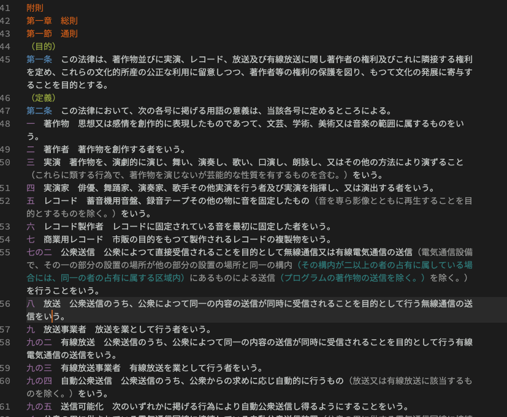
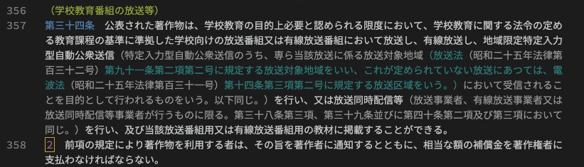

# HoureiHighlight README

法令テキストのハイライト表示

## 機能

法令のテキストデータの条・項・号番号(枝番号も含む)、編・章・節・款等の番号(枝番号も含む)、括弧書きなどの部分をハイライト表示します。



- 留意点
  - 上のスクリーンショット画像は"Monokai Dimmed"というテーマを適用した場合のものです。テーマが変わると、ハイライト表示の配色も変わります。
  - 括弧書き部分のハイライトについては、下の画像の通り、括弧がネストしているケースに対応しており、２重目の括弧については色を変えています。ただし、他の規定を引用したり改めたりしている箇所では括弧の対応関係をうまく判定できないケースがあります。
  - カギカッコに括られている内側も強調表示するようにしていますが、他の規定を引用したり改めたりしている箇所では括弧の対応関係をうまく判定できないケースがあります。



## 使い方

[e-gov法令検索](https://elaws.e-gov.go.jp)などから法令のテキストデータをコピペして、".rpw"という拡張子を付けて保存すると、ハイライトが適用されるようになります。

## アウトライン表示（CodeMapを使う）

この拡張を入れただけでは、サイドパネルにアウトラインを表示することはできません。アウトライン表示については、CodeMapという[拡張機能](https://marketplace.visualstudio.com/items?itemName=oleg-shilo.codemap)をインストールすることで可能になります。私はこの拡張機能をインストールして、`settings.json`に下記のように記述しています：

```json
 {
＜省略＞
    "codemap.rpw": [
    {
      "pattern": "^第[一二三四五六七八九十百千〇]+条(の[一二三四五六七八九十百の]+)?[ 　]+.{8}",
      "icon": "function"
    },
    {
      "pattern": "^[ 　]*((第[一二三四五六七八九十百〇]+[編章節款目](の[一二三四五六七八九十百の]+)?[ 　]+[^。 　]+)|(附[ 　]*則[ 　]*(（.+）[ 　]*)?抄?)|(別[ 　]*表[^。]*))$",
      "clear": "^[ 　]",
      "icon": "class"
    }
    ],
＜省略＞
 }
```

すると、下の画像のようになります。


詳細についてはCodeMapの[wiki](https://github.com/oleg-shilo/codemap.vscode/wiki/Adding-custom-mappers)を参照してください。
